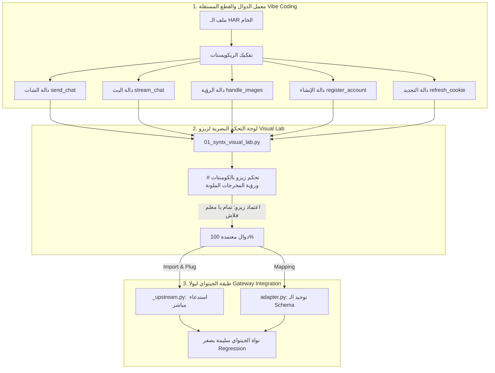

# 🏛️ وثيقة المواصفات المعمارية القياسية الثلاثية لمزود SYNTX AI
## Syntx Modular Architecture & Visual Lab Master Specification (v1.0)

> **📌 حالة الوثيقة:** معتمدة دستورياً — نتاج اتفاق تاريخي مشترك بين **المهندس بولا (مؤلف الدستور)** و**البروفيسور زيزو (مالك الرؤية والبصريات)** و**فلاش (Antigravity IDE)**.  
> **الموقع الحاكم:** `.AAA_GGG_iii_VIBE_CODING\🟢_syntx_ai\Root\SYNTX_MODULAR_ARCHITECTURE_SPEC.md`  
> **تاريخ الاعتماد الصوتي:** الفويسات 20، 21، 22، 29، 30.

---

### 🎯 1. الرؤية العامة وفلسفة التصميم (Core Philosophy)

الهدف هو بناء مزود **Syntx AI** كنموذج رائد عالمياً يجمع بين:
1. **التحكم والاختبار البصري التفاعلي لزيزو:** تشغيل كل ميزة بالألوان في التيرمينال واختبار الدومينات المؤقتة والكوكيز بحرية كاملة ودون غموض.
2. **الأمان المعماري والعزل الصارم لبولا:** حماية نواة الجيتواي (`__gateway-service`) بحيث يقتصر دور الجيتواي على **التركيب الصافي (Plug & Play Assembly)** عبر الاستدعاء المباشر للدوال المجربة سلفاً.
3. **الكود النظيف المنيع لفلاش:** تقسيم الكود إلى دوال مستقلة ذاتياً (Self-contained Atomic Functions) مع تطعيم النظام ضد كافة الأخطاء والانتكاسات المكتشفة في المشاريع السابقة.

---

### 🧩 2. المعمارية التناغمية الثلاثية (The 3-Tier Assembly)



---

### 🧱 3. تفصيل طبقات التنفيذ الهندسية

#### الطبقة الأولى: مكتبة القطع والدوال المستقلة (`syntx_components.py`)
تُبنى داخل مجلد المزود في الـ Vibe Coding، وتضم دوال منفصلة ذاتية الاكتفاء:
1. **`syntx_chat_request(messages, model, cookies, proxies=None)`**:
   - مسؤولة عن إرسال برومبت المستخدم واستخراج الرد الصافي.
   - تتعامل تلقائياً مع معرّف المحادثة ونصوص الردود.
2. **`syntx_stream_request(messages, model, cookies, ...)`**:
   - مسؤولة عن الرد المتدفق (SSE / Chunked Response) وإرجاع مولّد (Generator).
3. **`syntx_vision_request(image_bytes, prompt, model, cookies)`**:
   - معالجة الصور، استخراج الـ Mime types، وإرسالها وفق بايلود الـ HAR المعتمد.
4. **`syntx_register_account(domain_provider="tempmailclub", ...)`**:
   - التعامل مع Livewire وتوليد الإيميلات المؤقتة وتفعيل الحساب وجلب الكوكيز الأولية.
5. **`syntx_refresh_session(cookies)`**:
   - فحص صلاحية الكوكي وتجديده في الخلفية.

#### الطبقة الثانية: معمل زيزو البصري التفاعلي (`01_syntx_visual_lab.py`)
الملف التشغيلي المخصص للباشمهندس زيزو:
- **واجهة تيرمينال بصرية غنية:** طباعة الردود، الحسابات، الكوكيز، وحالة السيرفر بنصوص ملونة وإيموجيز واضحة.
- **مفاتيح تحكم بالكومنتات (`# Toggle Switches`):**
  ```python
  # === لوحة تحكم المعلم زيزو (علّم بكومنت # لتعطيل أي اختبار) ===
  TEST_CHAT = True          # تجربة إرسال شات عادي
  TEST_STREAM = False       # تجربة البث المتدفق
  TEST_VISION = True        # تجربة قراءة الصور
  TEST_REGISTER = False     # تجربة إنشاء حساب جديد بالدومين المؤقت
  TEST_REFRESH = False      # تجربة تجديد الكوكيز
  ```
- لا ينتقل أي كود للخطوة التالية إلا بعد تشغيل هذا الملف وتأكيد زيزو بعبارته الشهيرة: *"تمام يا معلم فلاش مفيش أي مشكلة"*.

#### الطبقة الثالثة: تركيب الجيتواي لبولا (`__gateway-service/providers/syntx/`)
تطبيق بنود الدستور دون تعقيد:
- في `_upstream.py`: مجرد استدعاء مباشر:
  ```python
  from .syntx_components import syntx_chat_request, syntx_stream_request
  ```
- في `adapter.py`: تحويل استجابة الدالة إلى كائن `ProviderResponse` القياسي للجيتواي وتصنيف الأخطاء تحت الـ 12 `ErrorCategory`.
- **النتيجة:** حماية بنية الجيتواي من التعديل العشوائي، وضمان اجتياز الـ 134 اختباراً المعتمدة بنجاح 100%.

---

### 🛡️ 4. التحصين المكتسب من دروس وأخطاء المشاريع السابقة (Cross-Project Immunization)

استجابة لتوجيه البروفيسور زيزو الصريح في الفويس 30: *"عايزك تتعلم إيه اللي حصل هناك علشان ما نغلطش في زيه"*:

| الخطأ السابق المستفاد منه | الكود الوقائي | المعيار في Syntx |
|---|---|---|
| **فخ الإغلاق القاتل (Fail-Closed Trap)** | `M-060` / `M-062` | عند فشل تجديد الكوكيز أو إنشاء حساب جديد، يُمنع إيقاف المزود؛ يتم التجاوز الآمن (`Safe Bypass`) واستخدام الحسابات المخزنة سلفاً (Fail-Open). |
| **الكتابة المتزامنة في مجلدين روت (Dual-Root Violation)** | `M-061` | كافة دفاتر الحالة والوثائق محصورة حصراً داخل `.AAA_GGG_iii_VIBE_CODING\🟢_syntx_ai\Root` وممنوع لمس أي روت خارجي. |
| **افتراض معايير عشوائية دون إثبات (Inverted Heuristic)** | `M-056` | عدم وضع أي شروط افتراضية للتأخير أو الحسابات إلا ببرهان سطري مستخرج من تشغيل حي أو من ملف الـ HAR. |
| **انهيار قراءة النصوص على ويندوز (Windows cp1252)** | `M-059` | إلزام استخدام `encoding="utf-8"` صراحة في كل دالة قراءة أو كتابة للملفات. |

---

### 🚀 5. خطة التنفيذ المرحلية (Milestone Roadmap)

1. **المرحلة 1: بناء مكتبة القطع والدوال (`syntx_components.py`)**:
   - كتابة دوال الشات، الصور، والإنشاء مفصلة ومستقلة استناداً لكتل الـ HAR المعتمدة.
2. **المرحلة 2: تدشين معمل زيزو البصري (`01_syntx_visual_lab.py`)**:
   - تسليم الملف لزيزو ليختبر الميزات دالة دالة ويتحكم بالسويتشات في التيرمينال.
3. **المرحلة 3: النقل والتركيب بالجيتواي (Assembly Gate)**:
   - ربط الدوال المجربة في `_upstream.py` وتشغيل حزم اختبارات `pytest`.
4. **المرحلة 4: المراجعة الخارجية المزدوجة عبر GitHub (Bolla Law #9)**:
   - رفع الكود على مستودع GitHub ودعوة وكيل خارجي مستقل لتدقيق المتانة وفحص الضغط وإصدار تقرير الجودة.
