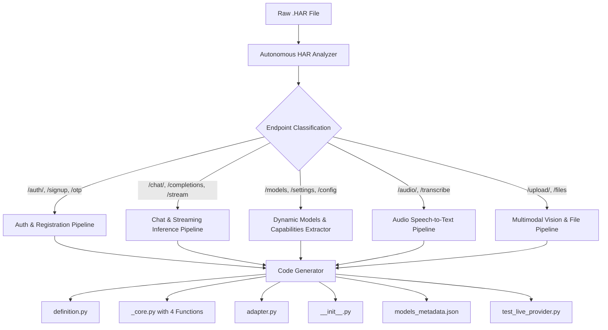

# 🏛️ UNIVERSAL PROVIDER SPECIFICATION & ARCHITECTURAL BLUEPRINT (v3.0)
## Autonomous HAR Scaffolding, Dynamic Capability Ingestion & 15-Minute SLA Standard
**Authors & Architectural Authority:** Eng. Bolla (Lead Architect) & Eng. Zizo (Product Visionary)  
**System:** AI Gateway Service (`__gateway-service/`)  
**Target Audience:** Any AI Coding Agent (Flash / Claude Opus / Sonnet / Codex) & Human Engineers  
**Compliance Standard:** Bolla Constitution v1.2 & ADR-0008 (Gateway Wire Contract v1)  
**Target SLA:** **"Raw HAR In ➡️ Tested Production Provider Out in < 15 Minutes" ("ربع ساعة! طخ طخ طخ!")**  
**Status:** Canonical Master Standard (Version 3.0 — Builds upon v1.0 and v2.0 additively with zero breaking changes)

---

## ⚡ 1. The Paradigm Shift: From 60 Minutes to the 15-Minute SLA

In Blueprint v2.0, we established the 60-minute benchmark for onboarding providers.  
However, as articulated by **Eng. Zizo in Voices 97 & 98**, manual inspection of massive `.har` archives, hand-coding repetitive HTTP dictionaries, and deciphering JSON response envelopes introduces human friction, fatigue, and unnecessary delays.

> ### 🚀 The Zizo 15-Minute Operational Mandate ("ربع ساعة طخ طخ طخ"):
> *"أنا عاوز أعمل المزود ده يخلص في ربع ساعة! تقول لي إزاي؟ في حاجة كدا زي سكريبت كدا، يفلتر الـ HAR: بتاع الشات، بتاع الإنشاء، بتاع الـ Refresh، بتاع الموديلات، والكابابيليز... يتعمل كله أوتوماتيك كدا في السريع!"*  
> — **المهندس زيزو (فويس رقم 98)**

### ⏱️ The 15-Minute Stopwatch Breakdown:

| Time Window | Phase Name | Execution Mechanism | Output / Deliverable |
|:---|:---|:---|:---|
| **00:00 – 02:00** | **HAR Capture** | Browser DevTools (Capture: Signup, Chat, Vision, Audio, Models) | Raw `.har` file exported to workspace |
| **02:00 – 04:00** | **Autonomous Scaffolding** | Run `py tools/har_to_provider.py <har> --slug <name>` | Auto-generates the **4 Clean Files** + test suite in < 30 seconds |
| **04:00 – 08:00** | **Surgical Calibration** | Quick human/agent verify of OTP regex or specific token location | `_core.py` tuned to 100% precision |
| **08:00 – 12:00** | **Live Diagnostics** | Run `py test_live_gateway.py` (Verify chat, models, vision, audio) | Green terminal output & verified capability matrix |
| **12:00 – 15:00** | **Hermetic Gates & Commit** | Run `pytest` suite + git commit & push | Provider production-ready & merged into Gateway |

---

## 🤖 2. The Autonomous HAR Scaffolding Engine (`tools/har_to_provider.py`)

To achieve the 15-minute SLA, the Gateway provides an automated ingestion tool:  
`__gateway-service/tools/har_to_provider.py`.

### 🔬 How the Autonomous Scaffolder Operates:


### 🎯 Key Classification Heuristics:
1. **Auth & Registration:**
   - Detects endpoints matching `*register*`, `*signup*`, `*otp*`, `*verify*`, `*auth*`, `*token*`.
   - Extracts JSON body schemas and headers (`Content-Type`, `Origin`, `Referer`, CSRF tokens).
   - Generates the standard `register(timeout)` flow using `curl_cffi` chrome124 impersonation and TempMail Livewire parsing.
2. **Chat & Text Generation:**
   - Detects endpoints with `*chat*`, `*completion*`, `*conversation*`, `*ask*`.
   - Distinguishes Server-Sent Events (`text/event-stream`) from buffered JSON (`application/json`).
   - Automatically injects feature flags: `thinking`, `deep_research`, `plan`, `tools`.
3. **Dynamic Models & Capabilities:**
   - Detects models lists and capability flags:
     - **Thinking Levels:** Detects `thinking`, `reasoning_effort` (`low`, `medium`, `high`, `max`, `ultra`).
     - **Web Search:** Detects `web_search`, `deep_research`, `browse`.
     - **Vision Support:** Checks for image payload fields (`images`, `image_url`, `file_ids`).
     - **Audio STT:** Detects `audio/transcribe` or audio upload endpoints.
   - Generates `models_metadata.json` preserving 100% upstream fidelity.
4. **Adapter & Definition:**
   - Maps upstream models to Gateway closed capability set (`tools_call`, `web_search`, `image_generation`, `structured_output`, `code_interpreter`).
   - Declares the standard Facade adapter mapping context to result with the 12 typed errors.

---

## 🏗️ 3. The 4 Clean Files Architecture (Preserved from v2.0)

Every provider inside `__gateway-service/providers/<slug>/` consists strictly of **EXACTLY 4 FILES**:

```
__gateway-service/providers/<slug>/
├── __init__.py           # Exports DEFINITION and HANDLERS only
├── definition.py         # Declares display name, closed capabilities, operations, declared models
├── _core.py              # Layer 1: Autonomous engine implementing the 4 Universal Core Functions
└── adapter.py            # Layer 2: Facade Adapter mapping ProviderContext <-> FacadeResult (12 errors)
```

With two local data assets:
- `models_metadata.json`: Full upstream capabilities matrix (thinking levels, search, vision, audio).
- `accounts_<slug>.json`: The persistent accounts pool (managed under atomic `FileLock`).

---

## 🧩 4. The 4 Core Functions Contract (`_core.py`)

Every auto-generated `_core.py` conforms to the strict Layer 1 specifications:

### Function 1: `register(timeout: int = 120) -> dict`
- Provisions fresh verified accounts using browser TLS impersonation.
- Automatically handles Livewire DOM morphing (`effects.html`) and regex OTP extraction (`\b\d{6}\b`).
- **Atomic Cleanup Guarantee:** Calls `delete_email()` in a `finally:` block to reset daily mailbox quotas.
- **Output:** `{"email": str, "token": str, "chat_uuid": str, "status": "active", "created_at": str}`

### Function 2: `refresh(account: dict) -> bool`
- Fast, non-crashing probe of account validity.
- Returns `True` if operational; `False` if revoked/depleted.

### Function 3: `ask(model: str, prompt: str, image_b64: str = None, image_format: str = None, timeout: int = 120) -> dict`
- **Non-Vision Guard:** Immediately intercepts text-only models before touching network (returns `UpstreamFailure("unsupported_capability")` in < 5ms).
- **Autonomic Reasoning Injection:** Injects `thinking: True`, `deep_research: True`, `plan: True`, and tools by default.
- **Proactive Background Refill:** Dispatches a non-blocking daemon thread on every request to provision 5 fresh accounts.
- **Fast Failover on Quota:** If upstream returns `429` with `window_violated: "7d"`, evicts the token immediately and switches to the next account without downtime.

### Function 4: `transcribe_audio(audio_bytes: bytes, audio_format: str = "webm", timeout: int = 60) -> dict`
- Multipart form dispatch to native speech-to-text endpoints.
- Auto-detects audio format MIME types (`audio/webm`, `audio/mp3`, `audio/wav`).
- Returns `{"text": str, "model": str, "duration": float | None}`.

---

## 🛡️ 5. The Bolla Quality Verification Triangle (Mandatory Gateway Gate)

No provider may be registered into `gateway/app.py` without passing all 3 sides of the **Bolla Verification Triangle**:

```
                  ▲
                 / \
                /   \
   [Level 1]   /     \   [Level 2]
  Live Diagnostic     Stress & Concurrency
  (test_live.py)       (test_stress.py)
              /       \
             /_________\
              [Level 3]
           Hermetic Pytest
           (100% Mocked)
```

1. **Level 1: Live Diagnostic (`test_live_gateway.py`):**
   - Direct execution against live upstream servers.
   - Tests: Discovery (`/v1/describe`), Models list, Text generation, Thinking output, Non-vision guard rejection, Image analysis, Audio transcription.
2. **Level 2: Stress & Concurrency (`test_stress_gateway.py`):**
   - Spawns concurrent threads to test `FileLock` integrity, FIFO queue replenishment, and zero-race-condition safety.
3. **Level 3: Hermetic Unit Tests (`pytest tests/`):**
   - 100% offline, fully isolated with mocks.
   - Validates all 12 typed error mappings (`InvalidPayload`, `UpstreamFailure`, `AuthFailure`, `ModelNotFound`, `RateLimitExceeded`, etc.).

---

## 📋 6. Step-by-Step Operator Checklist for Eng. Zizo & Developers

```bash
# الخطوة 1: التقاط الـ HAR من المتصفح وحفظه في مجلد المعمل
# مسار الـ HAR: .AAA_GGG_iii_VIBE_CODING/🟢_<provider>_ai/har/traffic.har

# الخطوة 2: تشغيل سكريبت التوليد الآلي الصاروخي (يأخذ 15-30 ثانية فقط!)
py -3.13 tools/har_to_provider.py ../path/to/traffic.har --slug notegpt

# الخطوة 3: فحص سريع (دقيقتين) للملفات الأربعة المتولدة في providers/notegpt/
# __init__.py, definition.py, _core.py, adapter.py

# الخطوة 4: تشغيل الاختبار الحي المباشر
py -3.13 test_live_gateway.py --provider notegpt

# الخطوة 5: تشغيل حزمة الاختبارات الهرمتيكية
pytest tests/test_notegpt_*.py

# الخطوة 6: الرفع إلى GitHub والاحتفال بالإنجاز في أقل من 15 دقيقة! 🚀
git add .
git commit -m "feat(notegpt): onboard provider via autonomous HAR scaffolder in 15 mins"
git push
```

---

## 📜 7. Architectural Governance & Legacy Protection
- **Rule 1 (Additive Only):** Blueprint v3.0 supersedes v2.0 and v1.0 conceptually without altering or breaking existing providers (`syntx`).
- **Rule 2 (Closed Key Set):** Gateway contracts (`gateway/contracts.py`) remain untouched; capability expansion occurs cleanly via metadata overlays.
- **Rule 3 (Zero Regression):** The 171 existing unit tests must remain 100% green at all times.
