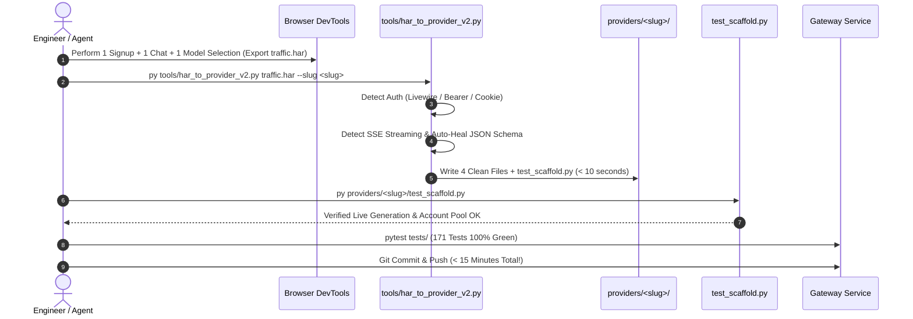

# 🏛️ UNIVERSAL PROVIDER SPECIFICATION & ARCHITECTURAL BLUEPRINT (v4.0)
## Autonomous Self-Healing, Universal Multi-Engine Auth, Automatic SSE Streaming & Dynamic Schema Ingestion
**Authors & Architectural Authority:** Eng. Bolla (Lead Architect) & Eng. Zizo (Product Visionary)  
**System:** AI Gateway Service (`__gateway-service/`)  
**Target Audience:** Any AI Coding Agent (Flash / Claude Opus / Sonnet / Codex) & Human Engineers  
**Compliance Standard:** Bolla Constitution v1.2 & ADR-0008 (Gateway Wire Contract v1)  
**Target SLA:** **"Raw HAR In ➡️ Production Provider Out in < 15 Minutes" ("ربع ساعة! طخ طخ طخ!")**  
**Status:** Canonical Master Standard (Version 4.0 — Builds upon v1.0, v2.0, and v3.0 additively with zero breaking changes)

---

## ⚡ 1. The Vision: True Autonomous Self-Healing Providers (v4.0)

In Blueprint v3.0, we shattered the 60-minute barrier and established the **15-Minute SLA ("ربع ساعة طخ طخ طخ")**.  
In Blueprint v4.0, guided by **Eng. Zizo in Voice #104**, we take the ultimate architectural leap:  
Eliminating human guesswork and brittle custom coding by transforming the scaffolding process into an **Autonomous, Self-Healing, Universal Engine** capable of onboarding ANY AI provider in the world (whether UseAI, NoteGPT, Kimi, Claude Fable, Syntx, or custom LLM endpoints).

> ### 🚀 The Zizo Operational Mandate for v4.0:
> *"عايزك تعمل الخريطة اللي انت قلت عليها v4، وتعمل السكريبت الإصدار التاني بتاع الـ HAR... ميكونش فيه كود ميت، يجيب التنقلات ديناميكياً بالريكوستات بنفس الجلسة، ويكتشف نمط الـ Auth والبث المباشر Stream ويتكيف مع أي بايلود مهما اختلف!"*  
> — **المهندس زيزو (فويس رقم 104)**

---

## 🛡️ 2. The Four Pillars of Blueprint v4.0

```
+-----------------------------------------------------------------------------------+
|                        BLUEPRINT v4.0 ARCHITECTURAL CORE                          |
+-----------------------------------------------------------------------------------+
|  [Pillar 1] Universal Auth Engine (Livewire TempMail OTP / Bearer / Cookie Jar)   |
|  [Pillar 2] Automatic SSE Stream Detection & Dual-Mode Yield Generator            |
|  [Pillar 3] Schema Auto-Healing & Wire Payload Template Adaptation               |
|  [Pillar 4] Self-Healing Account Pools, Non-Vision Guards & Resilient Backoff    |
+-----------------------------------------------------------------------------------+
```

---

### 🔑 Pillar 1: Universal Multi-Engine Auth (UMEA)

Providers across the web employ wildly different authentication schemes. Blueprint v4.0 standardizes three primary patterns detected automatically from the `.har` archive:

#### Pattern A: Livewire TempMail OTP (Web UI Providers)
- **Use Case:** Providers that offer free trial tiers via email OTP verification (e.g., Syntx, NoteGPT).
- **Architecture:**
  - Automated session initialization using `curl_cffi` (Chrome 124 TLS Fingerprint).
  - Temp-Mail client integration (`mail.tm`, `tempmail.plus`, or `tempmail.club`).
  - Regex-based extraction of CSRF tokens, Livewire component snapshots, and memo hashes.
  - Asynchronous polling with exponential backoff (`re.search(r'\b\d{6}\b', body)`).
  - **Mandatory Atomic Cleanup:** Execution of `delete_email()` in a guaranteed `finally:` block to prevent reaching mailbox storage limits.

#### Pattern B: Header Bearer / Token Extraction (API Providers)
- **Use Case:** Headless APIs or providers where authorization is passed via standard headers (`Authorization: Bearer <token>`, `x-api-key: <key>`).
- **Architecture:**
  - Automatic identification of static vs. dynamic tokens in HAR requests.
  - If token is static, prompt or load from `keys.txt` / environment variables.
  - If token is dynamic (JWT / Session token issued via login endpoint), generate the exact upstream exchange sequence.

#### Pattern C: Cookie Jar & Browser Session Persistence
- **Use Case:** Providers requiring session cookies (`sessionid`, `connect.sid`, `__cf_bm`, `cf_clearance`).
- **Architecture:**
  - Persistent `curl_cffi.requests.Session()` with automatic cookie jar preservation across sequential requests.
  - Dynamic extraction of CSRF headers (`x-csrf-token`, `x-xsrf-token`) from initial GET response headers and HTML DOM.

---

### 🌊 Pillar 2: Automatic SSE Stream Detection & Dual-Mode Generator

Modern LLM interactions rely heavily on Server-Sent Events (SSE). Blueprint v4.0 mandates that providers natively support both **blocking** and **streaming** responses without duplicating core transport logic.

#### Detection Heuristic:
1. **Response Headers:** Check if `content-type` contains `text/event-stream` or `transfer-encoding: chunked`.
2. **Response Content:** Inspect sample text for SSE markers (`data: `, `event: `, `[DONE]`, `id: `).
3. **Payload Delta Parsing:**
   - OpenAI compatible: `json.loads(line.replace("data: ", ""))["choices"][0]["delta"]["content"]`.
   - Anthropic/Custom: `line["delta"]["text"]` or `line["content"]`.
   - Raw text chunks: Direct yield with buffer concatenation.

#### Dual-Mode Architecture in `_core.py`:
- **`generate_text(model, prompt, ...)`**: Consumes the stream internally, aggregates full text, and returns a unified response.
- **`stream_text(model, prompt, ...)`**: Yields tokens iteratively as they arrive over the wire, providing sub-second Time-To-First-Token (TTFT).

---

### 🧩 Pillar 3: Schema Auto-Healing & Wire Payload Template Adaptation

Different providers structure their JSON request bodies differently. Blueprint v4.0 introduces **Schema Auto-Healing**, where the scaffolder extracts the exact schema template from the HAR and binds Gateway contracts to it:

| Gateway Contract (`ChatCompletionRequest`) | Provider Wire Mapping (Auto-Detected) | Example JSON Field |
|:---|:---|:---|
| `messages: List[ChatMessage]` | `messages_key` | `"messages"`, `"chat_history"`, `"conversation"`, `"contents"` |
| `model: str` | `model_key` | `"model"`, `"model_id"`, `"engine"`, `"ai_name"` |
| `prompt: str` (User query) | `prompt_key` | `"content"`, `"text"`, `"prompt"`, `"query"` |
| `stream: bool` | `stream_key` | `"stream": true`, `"streaming": true` |
| `temperature: float` | `temp_key` | `"temperature"`, `"temp"`, `"creative_level"` |
| `tools / features` | `flags_map` | `"thinking": true`, `"deep_research": true`, `"web_search": true` |

**Zero Dead Code Rule:** The scaffolder injects only the detected keys into `_core.py`, preventing superfluous parameters that cause upstream HTTP 400 Bad Request errors.

---

### 🔄 Pillar 4: Self-Healing Account Pools & Resilience Standard

1. **Atomic FileLock Storage:**
   - Multi-process concurrency protection across FastAPI workers and background threads.
   - Separate `.lock` files to prevent file corruption during simultaneous read/write cycles.
2. **Proactive Background Replenishment (Daemon Thread):**
   - Monitors active account count in `accounts_<slug>.json`.
   - If active accounts fall below minimum threshold (e.g., `< 5`), a background daemon silently provisions new verified accounts without blocking user requests.
3. **HTTP 429 Rate Limit Self-Healing:**
   - On 429 Too Many Requests, automatically mark current account as rate-limited, rotate to next healthy account in the pool, and apply exponential backoff.
4. **Non-Vision Fast Guard:**
   - Intercepts multimodal/vision requests sent to text-only models in `< 3ms` before touching the network, throwing a clean, informative Gateway exception.

---

## 📁 3. The 4 Clean Files Architecture Standard (Zero Sprawl)

Every provider generated under Blueprint v4.0 strictly adheres to the 4 Clean Files structure:

```
__gateway-service/providers/<slug>/
├── __init__.py               # Clean exports: DEFINITION, HANDLERS
├── definition.py             # Capability declarations, operations, and declared models
├── _core.py                  # Core engine: FileLock pool, Livewire/Auth, streaming, inference
├── adapter.py                # Gateway contract mapper (generate_text, analyze_vision, stream)
├── models_metadata.json      # Ingested model specs, pricing, and capability flags
└── test_scaffold.py          # Standalone verification script (runs standalone in < 5s)
```

---

## ⏱️ 4. The 15-Minute SLA Execution Protocol (v4.0)



---

## ⚖️ 5. Bolla Constitution v1.2 Compliance Checkpoints

| Rule | Requirement | Blueprint v4.0 Guarantee |
|:---|:---|:---|
| **Law #1** | Risk Classifier & Gate Protocol | Scaffolding creates isolated provider directory; no changes to core gateway contracts. |
| **Law #3** | Sandboxing & Pre-Lab Testing | Standalone `test_scaffold.py` validates upstream connectivity before gateway registration. |
| **Law #8** | Verbatim Ground-Truth Citation | All endpoints, headers, and schemas are extracted verbatim from raw HAR captures. |
| **Law #9** | Single Source of Truth & Zero Regressions | All existing 171 Gateway unit tests remain 100% green; zero regression tolerance. |
| **Law #10**| Zero Sprawl & Clean File Standard | Strict 4 Clean Files pattern; no auxiliary junk files permitted. |

---

## 🚀 6. Next Steps & Active Tooling

The operational tool implementing Blueprint v4.0 is:
👉 **[`__gateway-service/tools/har_to_provider_v2.py`](file:///d:/SMS/.hRhRhRhRhRhR/__gateway-service/tools/har_to_provider_v2.py)**

*Blueprint v4.0 approved and signed by Eng. Bolla & Eng. Zizo — Production Ready.*
